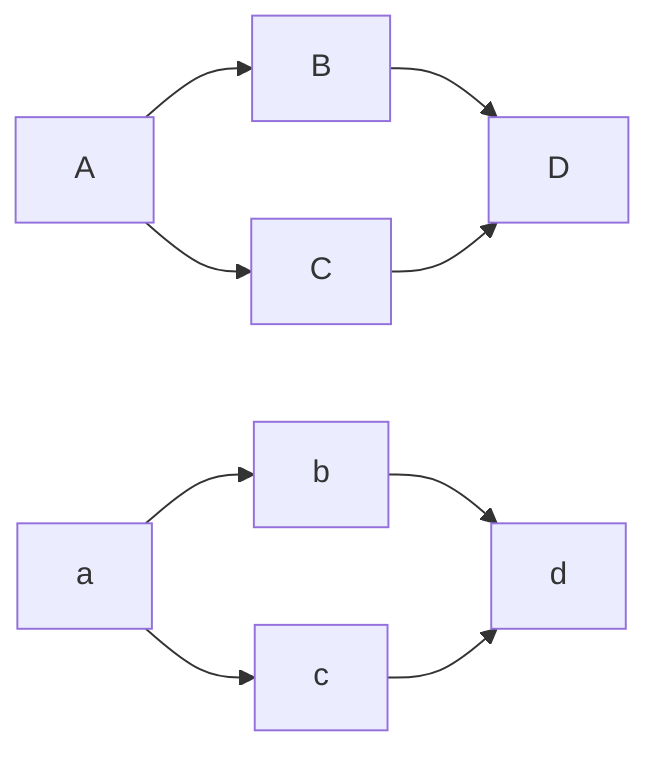

# A simple flow chart

Mermaid diagrams can be part of your markdown documents in GitHub, GitLab, Notion, Obsidian and many more.

You can also link to mermaid.live. Click on the following diagram...

