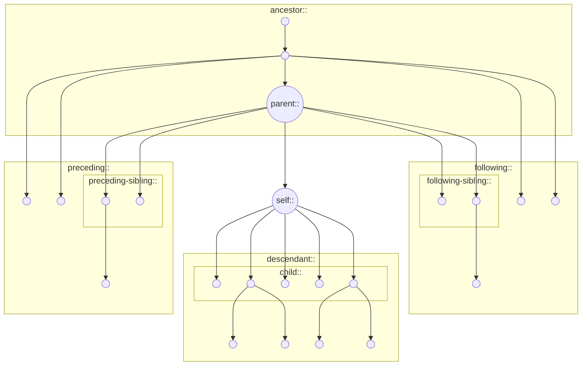

# XPath axes

```mermaid
flowchart TD

root(( )) --> ancestor(( ))

ancestor --> parent_sibling-2(( )) & parent_sibling-1(( )) & parent((parent::)) & parent_sibling+1(( )) & parent_sibling+2(( ))

parent --> sibling-2(( )) --> sibling-2_child(( ))
parent --> sibling-1(( )) & self((self::)) & sibling+1(( ))
parent --> sibling+2(( )) --> sibling+2_child(( ))

self --> child-2(( )) & child-1(( )) & child((child)) & child+1(( )) & child+2(( ))

subgraph descendant::
  subgraph child::
    child-2(( ))
    child-1(( ))
    child(( ))
    child+1(( ))
    child+2(( ))
  end
  child-1(( )) --> child-1_child-1(( )) & child-1_child+1(( ))
  child+2(( )) --> child+2_child-1(( )) & child+2_child+1(( ))
end

subgraph ancestor::
  parent
  ancestor
  root
end

subgraph preceding::
  parent_sibling-2
  parent_sibling-1
  subgraph preceding-sibling::
    sibling-2
    sibling-1
  end
  sibling-2_child
end

subgraph following::
  parent_sibling+1
  parent_sibling+2
  subgraph following-sibling::
    sibling+2
    sibling+1
  end
  sibling+2_child
end

```

It is not possible to have overlapping subgraphs, so it is not possible to show the axes
ancestor-or-self, descendant-or-self.