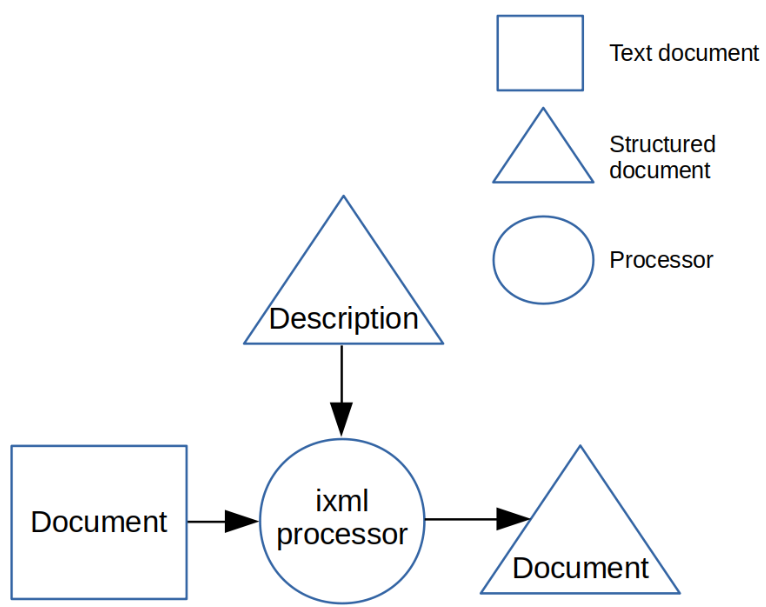
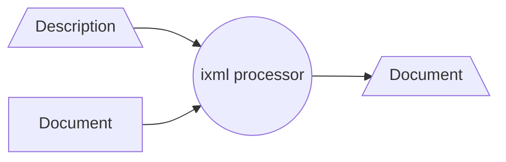
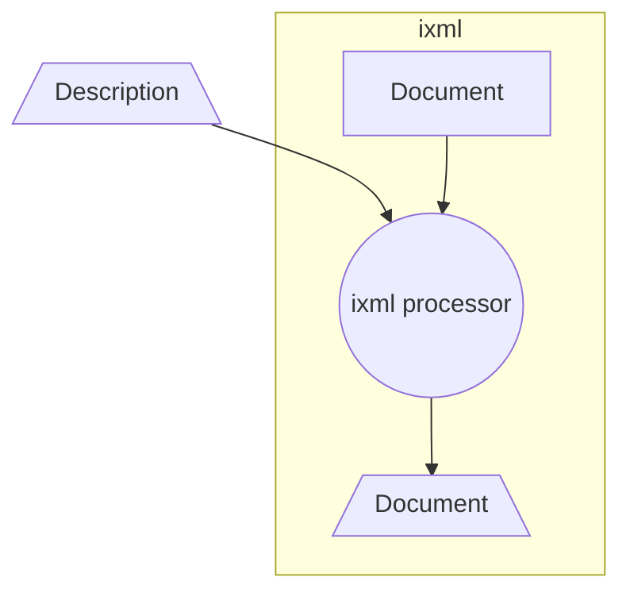
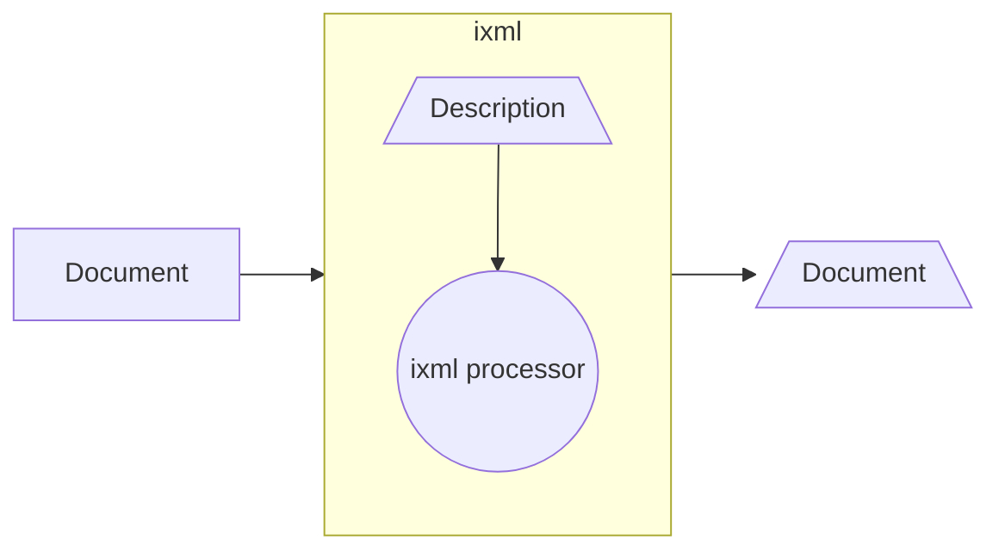

# Can we make Steven's diagram from 'A Declarative Code Browser with ixml and XForms'?

First attempt:

There is no way to indicate the direction of an arrow.

We can use subgraphs, but direction does not work when linking into the subgraph.

We can link to the subgraph.
Maybe this is the best we can do, but it is not what we want.

