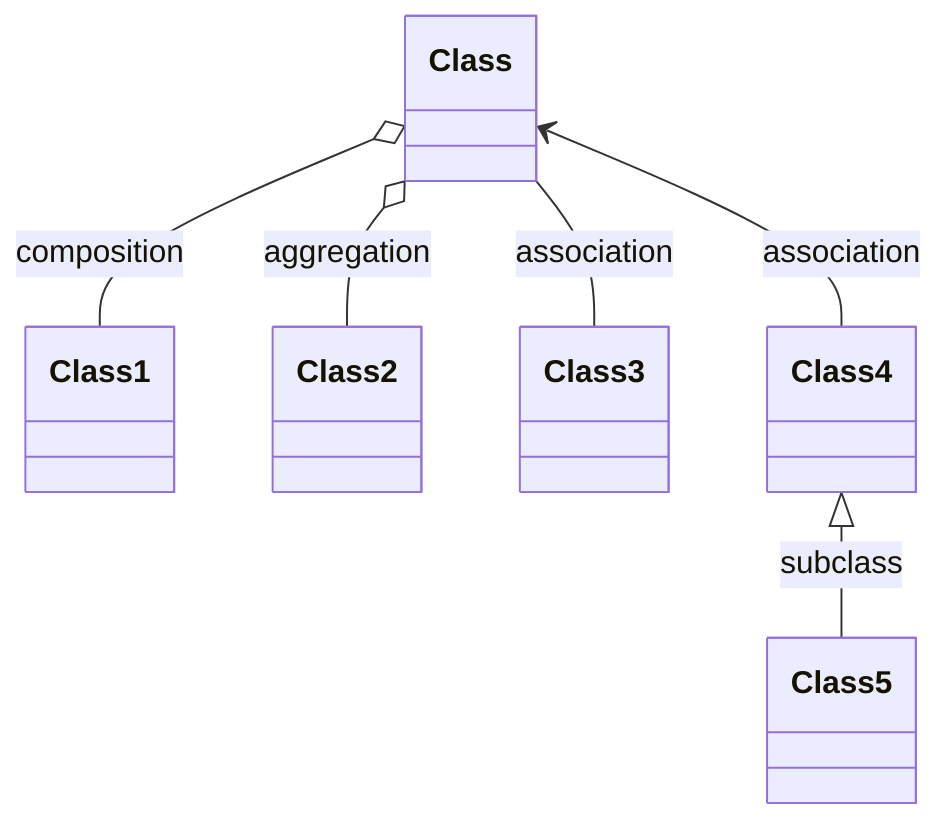
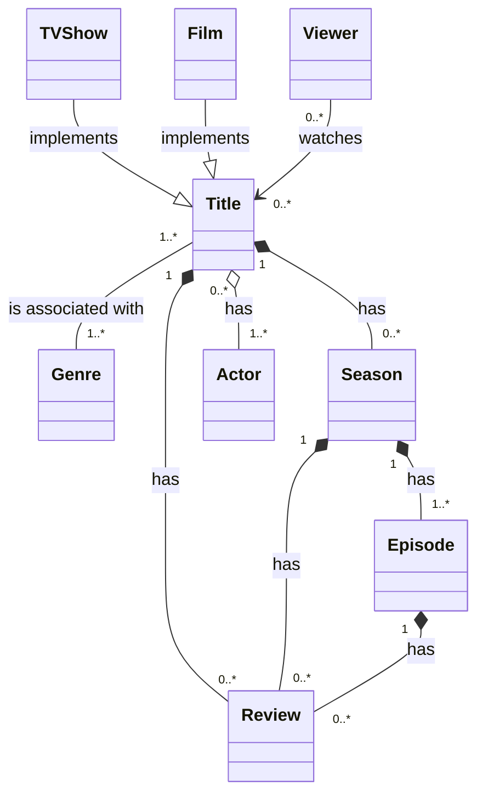

```mermaid
classDiagram
Class o-- Class1 : composition
Class o-- Class2 : aggregation
Class  -- Class3 : association
Class <-- Class4 : association
Class4 <|-- Class5 : subclass
```

```mermaid
classDiagram
Title "1..*" -- "1..*" Genre: is associated with
Title "1" *-- "0..*" Season: has
Title "1" *-- "0..*" Review: has
Title "0..*" o-- "1..*" Actor: has
TV Show --|> Title: implements
Film --|> Title: implements
Viewer "0..*" --> "0..*" Title: watches
Season "1" *-- "0..*" Review: has
Season "1" *-- "1..*" Episode: has
Episode "1" *-- "0..*" Review: has
```
