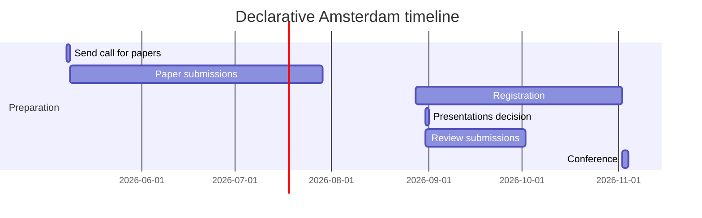
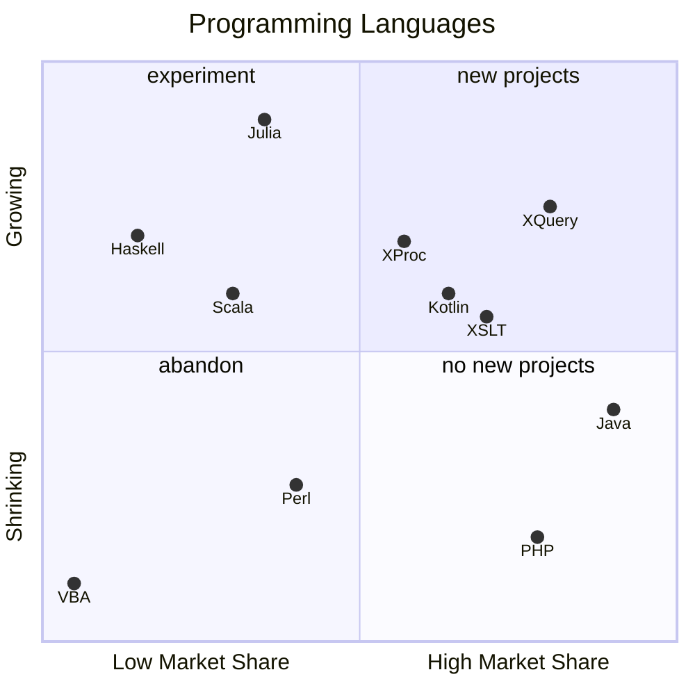
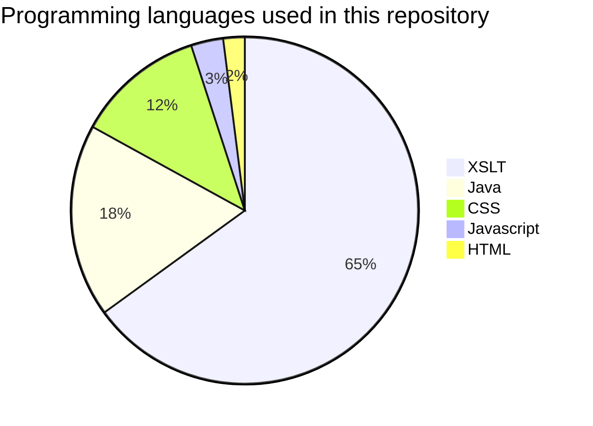
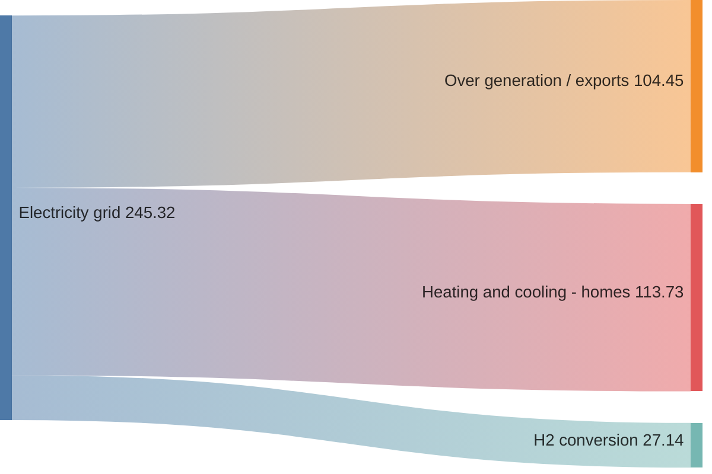
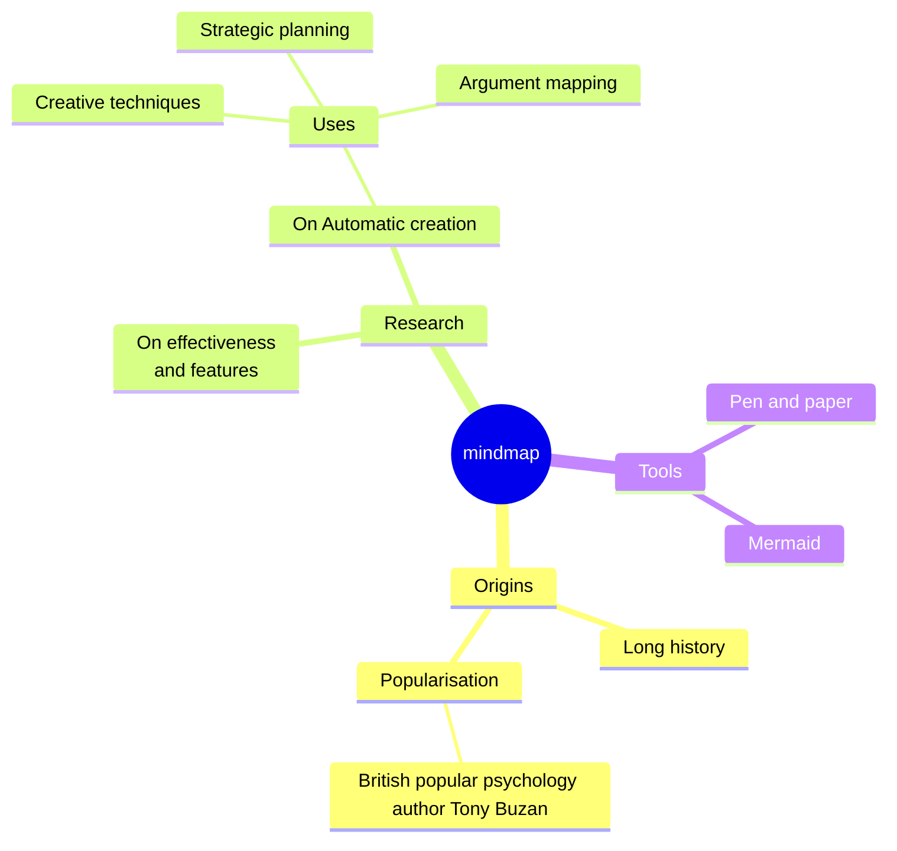

```mermaid
gantt title Declarative Amsterdam timeline
    dateFormat  MM-DD

    section Preparation
    Send call for papers :cfp, 05-08, 1d
    Paper submissions :after cfp, 81d
    Registration :reg, 08-28, 66d
    Presentations decision :dec, 08-31, 1d
    Review submissions :rev, 08-31, 10-02
    Conference :conf, 11-02, 2d
```

```mermaid
quadrantChart title Programming Languages
  x-axis Low Market Share --> High Market Share
  y-axis Shrinking --> Growing
  quadrant-1 new projects
  quadrant-2 experiment
  quadrant-3 abandon
  quadrant-4 no new projects
  Scala: [0.3, 0.6]
  Haskell: [0.15, 0.7]
  Julia: [0.35, 0.9]
  XProc: [0.57, 0.69]
  XSLT: [0.7, 0.56]
  XQuery: [0.8, 0.75]
  Kotlin: [0.64, 0.6]
  PHP: [0.78, 0.18]
  VBA: [0.05, 0.1]
  Perl: [0.40, 0.27]
  Java: [0.9, 0.4]
```

```mermaid
pie title Programming languages used in this repository
"XSLT" : 65
"Java" : 18
"CSS" : 12
"Javascript" : 3
"HTML" : 2
```

```mermaid
sankey-beta
Electricity grid,Over generation / exports,104.453
Electricity grid,Heating and cooling - homes,113.726
Electricity grid,H2 conversion,27.14
```

```mermaid
mindmap
  root((mindmap))
    Origins
      Long history
      ::icon(fa fa-book)
      Popularisation
        British popular psychology author Tony Buzan
    Research
      On effectiveness<br/>and features
      On Automatic creation
        Uses
            Creative techniques
            Strategic planning
            Argument mapping
    Tools
      Pen and paper
      Mermaid
```
