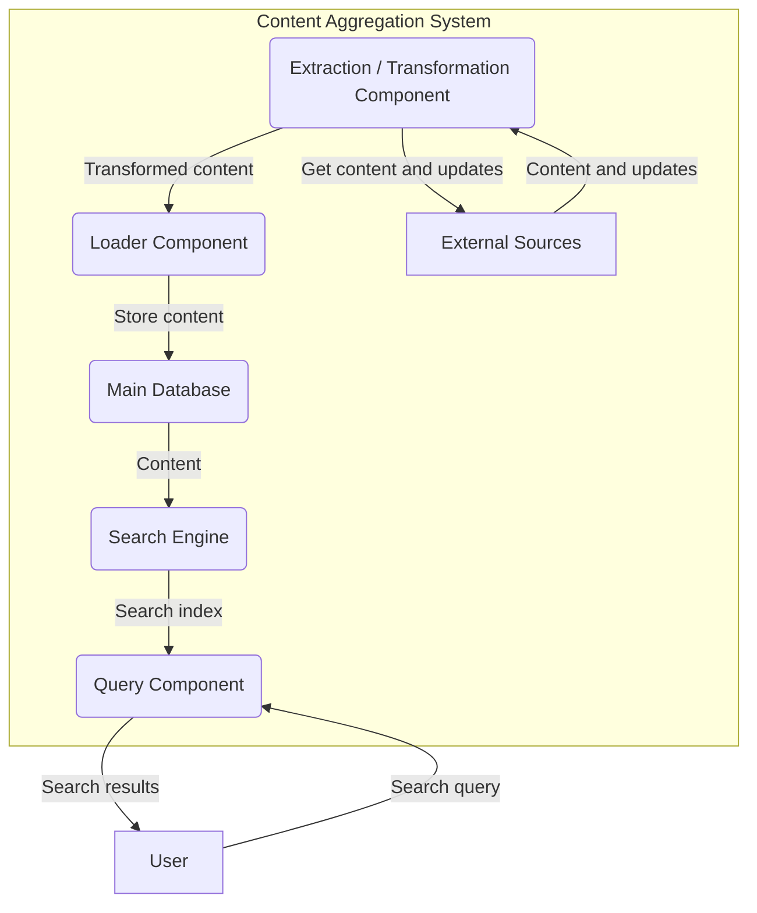
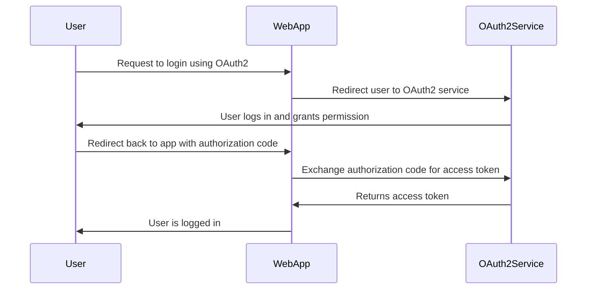
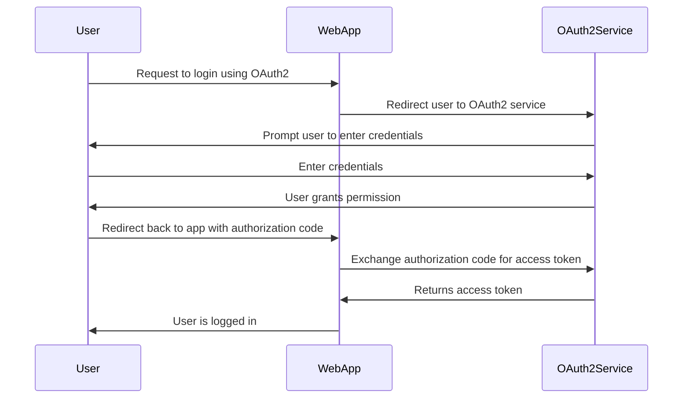

# Generate a context diagram

A content aggregation system consist of the following components:

1. A number of connectors to external sources.
2. An extraction / transformation component that gets content and updates from the external sources.
3. A loader component that stores the transformed content in the main database.
4. The main database stores the extracted and transformed content.
5. A search engine that creates and updates a search index for the content in the main database.
6. A query component that allows users to search the aggregated content.

Please create a C4 context diagram for this using Mermaid syntax.

# A sequence diagram

How can a user interact with an webapp and login using OAuth2? Please generate a sequence diagram in Mermaid syntax to explain.

## Answer | gpt-4 Model

In order to demonstrate a user interaction with a web application and login using OAuth2, we'll need to consider the following steps:

    The user requests to login using an OAuth2 service (like Google, Facebook, etc.) from the web application.
    The web application redirects the user to the OAuth2 service provider.
    The user logs into the OAuth2 service provider and grants the web application permission to access their data.
    The OAuth2 service provider redirects the user back to the web application with an authorization code.
    The web application exchanges the authorization code for an access token.
    The web application can now use the access token to access the user's data from the OAuth2 service provider.

Let's represent these steps in a sequence diagram using Mermaid syntax:

In this diagram:

* "User", "WebApp", and "OAuth2Service" are the participants in the sequence.
* The arrows "->>" represent the direction of communication between the participants.
* The texts along the arrows describe the actions that are taking place.

This sequence diagram should help visualize the process of a user interacting with a web app and logging in using OAuth2.

> Can you include the step where the user enters credentials?

Still not correct. The [original article](https://machinelearningmastery.com/generating-graphics-with-chatgpt/) asked for plantUML, which may be easier to find online.

